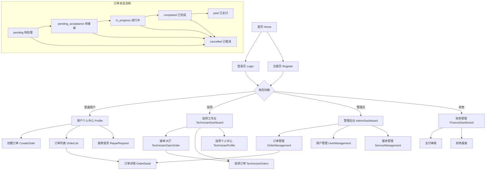
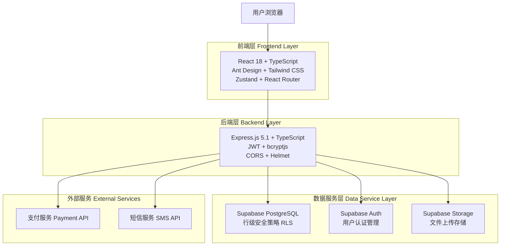
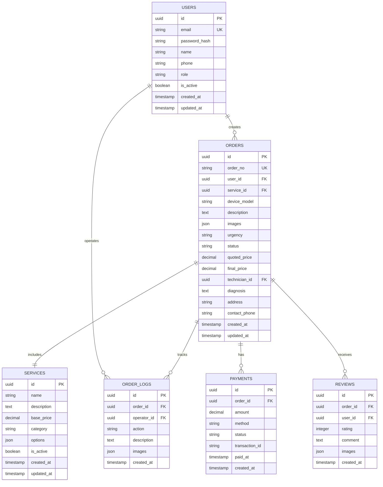
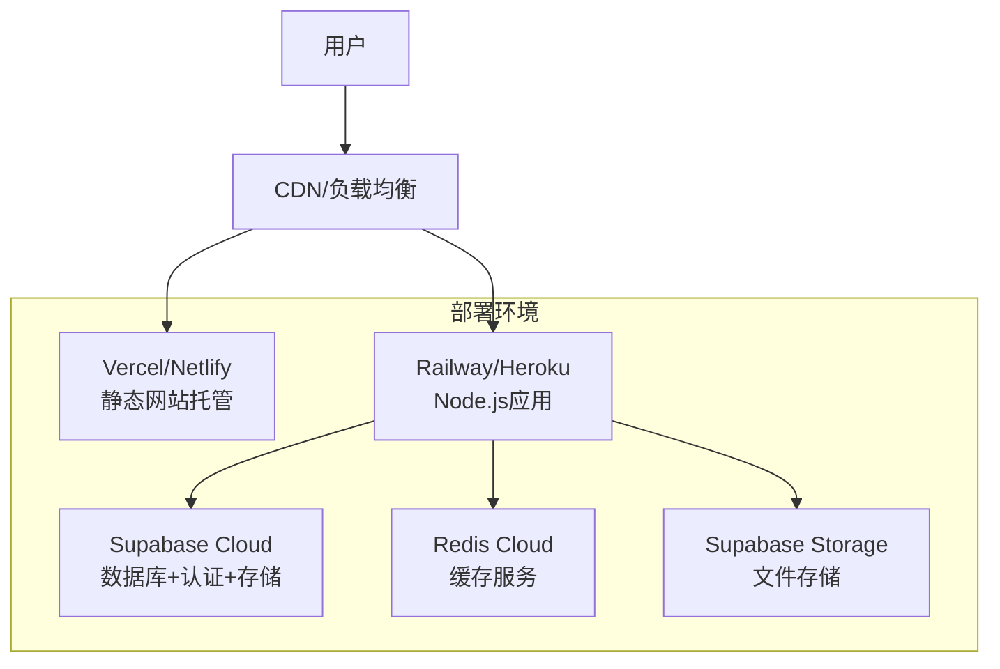

# 新干线闪修平台 - 产品需求文档

## 版本信息

- **文档版本**: v2.0
- **更新日期**: 2024-12-01
- **项目版本**: v1.0.1
- **维护人员**: 开发团队

## 1. 产品概述

### 1.1 产品定位

新干线闪修平台是一个现代化的设备维修服务平台，连接需要维修服务的用户和专业的维修技师。平台采用React 18 + Express.js + Supabase技术栈，提供完整的维修服务流程管理，从用户下单到维修完成的全程跟踪。

### 1.2 核心价值

平台主要解决传统维修行业信息不透明、服务质量参差不齐、用户体验差等问题，为用户提供便捷、透明、高质量的维修服务体验。支持手机、电脑等多种设备的维修服务，包括屏幕维修、电池更换、系统重装、数据恢复、清灰服务、软件安装、进水维修等多种服务类型。

### 1.3 产品目标

- 打造一个高效、可信赖的维修服务生态系统
- 提升整个维修行业的服务水平和用户满意度
- 成为用户首选的设备维修服务平台
- 实现维修服务的标准化、透明化、智能化

### 1.4 当前实现状态

- ✅ **核心功能**: 用户注册登录、订单管理、技师工作台、管理后台已完成
- ✅ **技术架构**: 前后端分离架构已搭建完成
- ✅ **数据库设计**: 完整的数据模型和权限控制已实现
- 🟡 **支付系统**: 基础框架已搭建，待集成第三方支付
- 🟡 **文件上传**: 基础功能已实现，待完善图片处理
- 🔴 **实时通知**: 待实现WebSocket实时通信

## 2. Core Features

### 2.1 用户角色系统

#### 角色定义与权限

| 角色     | 英文标识   | 注册方式       | 核心权限                                                                       | 实现状态    |
| -------- | ---------- | -------------- | ------------------------------------------------------------------------------ | ----------- |
| 普通用户 | user       | 邮箱+密码注册  | 浏览服务项目、创建维修订单、查看订单状态、在线支付、服务评价、个人信息管理     | ✅ 已实现   |
| 维修技师 | technician | 管理员分配账号 | 接单大厅抢单、更新维修进度、上传维修照片、填写诊断报告、完成订单、查看收入统计 | ✅ 已实现   |
| 管理员   | admin      | 系统预设账号   | 全系统管理权限、用户管理、订单管理、服务项目管理、技师分配、数据统计分析       | ✅ 已实现   |
| 财务人员 | finance    | 管理员分配账号 | 订单财务审核、支付状态管理、收款确认、财务报表查看、退款处理                   | 🟡 部分实现 |

#### 角色权限矩阵

| 功能模块     | 普通用户 | 维修技师 | 管理员 | 财务人员 |
| ------------ | -------- | -------- | ------ | -------- |
| 用户注册登录 | ✅       | ✅       | ✅     | ✅       |
| 创建订单     | ✅       | ❌       | ✅     | ❌       |
| 查看自己订单 | ✅       | ✅       | ✅     | ✅       |
| 接单抢单     | ❌       | ✅       | ✅     | ❌       |
| 更新订单状态 | ❌       | ✅       | ✅     | ❌       |
| 用户管理     | ❌       | ❌       | ✅     | ❌       |
| 服务管理     | ❌       | ❌       | ✅     | ❌       |
| 财务管理     | ❌       | ❌       | ✅     | ✅       |
| 数据统计     | ❌       | 部分     | ✅     | ✅       |

#### 用户认证流程

1. **注册流程**: 邮箱验证 → 基本信息填写 → 账号激活
2. **登录流程**: 邮箱+密码 → JWT Token生成 → 角色权限加载
3. **权限控制**: 基于JWT Token的角色验证 + 前端路由守卫 + 后端API权限检查

### 2.2 功能模块架构

#### 2.2.1 已实现功能模块

**用户端功能**

1. **首页 (Home)** ✅：平台介绍、服务项目展示、快速下单入口、用户导航
2. **用户认证** ✅：用户登录 (Login)、用户注册 (Register)
3. **订单管理** ✅：创建订单 (CreateOrder)、订单列表 (OrderList)、订单详情 (OrderDetail)
4. **报修请求 (RepairRequest)** ✅：快速报修入口
5. **个人中心 (Profile)** ✅：用户信息管理、订单历史、账户设置

**技师端功能**

1. **技师工作台 (TechnicianDashboard)** ✅：工作概览、订单统计
2. **接单大厅 (TechnicianClaimOrder)** ✅：可接订单列表、抢单功能
3. **技师订单管理 (TechnicianOrders)** ✅：已接订单、进度更新
4. **技师个人中心 (TechnicianProfile)** ✅：个人信息、工作统计

**管理端功能**

1. **管理后台仪表盘 (AdminDashboard)** ✅：数据概览、系统状态
2. **订单管理 (OrderManagement)** ✅：全部订单、状态管理、技师分配
3. **用户管理 (UserManagement)** ✅：用户列表、角色管理、权限控制
4. **服务管理 (ServiceManagement)** ✅：服务项目、价格管理

#### 2.2.2 待实现功能模块

**支付系统** 🔴

- 在线支付集成（支付宝、微信支付）
- 支付状态跟踪
- 退款处理

**通知系统** 🔴

- 实时消息推送
- 邮件通知
- 短信通知

**评价系统** 🟡

- 服务评价
- 技师评分
- 评价展示

**财务管理** 🟡

- 收入统计
- 财务报表
- 结算管理

### 2.3 页面详情

| 页面名称                   | 模块名称     | 功能描述                                                             |
| -------------------------- | ------------ | -------------------------------------------------------------------- |
| 首页 (Home)                | 导航栏       | 显示平台Logo、主要功能入口、用户登录状态、角色识别                   |
| 首页 (Home)                | 服务展示区   | 展示维修服务类型（手机维修、电脑维修、数据服务）、价格信息、服务特色 |
| 首页 (Home)                | 快速下单入口 | 提供快速下单按钮，引导用户进入订单创建流程                           |
| 登录页 (Login)             | 用户认证     | 手机号+密码登录、表单验证、角色自动识别、登录状态管理                |
| 注册页 (Register)          | 用户注册     | 基本信息填写（姓名、手机、邮箱）、密码设置、角色选择、表单验证       |
| 创建订单页 (CreateOrder)   | 服务选择     | 选择维修服务类型、查看服务详情和基础价格、预估时长                   |
| 创建订单页 (CreateOrder)   | 设备信息填写 | 填写设备类型、设备型号、故障描述、紧急程度选择                       |
| 创建订单页 (CreateOrder)   | 联系信息     | 填写联系地址、联系电话、预约时间选择                                 |
| 订单列表页 (OrderList)     | 订单筛选     | 按状态（待处理、进行中、已完成、已取消）、时间范围筛选               |
| 订单列表页 (OrderList)     | 订单展示     | 显示订单号、服务类型、状态、创建时间、操作按钮（查看详情、取消订单） |
| 订单列表页 (OrderList)     | 订单操作     | 查看订单详情、取消订单、联系技师、订单评价                           |
| 报修请求页 (RepairRequest) | 快速报修     | 简化的报修流程、常见问题选择、紧急报修处理                           |
| 个人中心页 (Profile)       | 用户信息管理 | 显示和编辑用户基本信息、头像上传、密码修改                           |
| 个人中心页 (Profile)       | 订单历史     | 查看历史订单、订单统计、重新下单、服务评价                           |
| 个人中心页 (Profile)       | 账户设置     | 通知设置、隐私设置、账户安全设置                                     |
| 管理后台                   | 订单管理     | 订单列表查看、状态批量更新、技师分配、订单详情管理                   |
| 管理后台                   | 用户管理     | 用户列表、角色权限管理、账号状态控制、用户信息编辑                   |
| 管理后台                   | 服务管理     | 服务项目管理、价格设置、服务分类管理、服务状态控制                   |
| 管理后台                   | 数据统计     | 订单统计分析、收入报表、用户活跃度分析、技师工作量统计               |

## 3. 核心业务流程

### 3.1 订单状态流程

#### 订单状态定义

- **pending**: 待处理（用户刚提交订单）
- **pending_acceptance**: 待接单（订单在接单大厅等待技师抢单）
- **in_progress**: 进行中（技师已接单，正在处理）
- **completed**: 已完成（维修完成，等待用户确认）
- **cancelled**: 已取消（订单被取消）
- **paid**: 已支付（用户已完成支付）

#### 状态流转图

```
用户下单 → pending → pending_acceptance → in_progress → completed → paid
                ↓              ↓              ↓           ↓
            cancelled      cancelled      cancelled   cancelled
```

### 3.2 用户端业务流程

#### 普通用户完整流程

1. **注册登录**: 邮箱注册 → 邮箱验证 → 完善个人信息 → 登录系统
2. **下单流程**: 浏览首页服务项目 → 选择维修服务类型 → 创建订单（填写设备信息、故障描述、联系信息） → 选择紧急程度 → 提交订单
3. **订单跟踪**: 查看订单状态 → 等待技师接单 → 与技师沟通 → 跟踪维修进度
4. **完成支付**: 确认维修完成 → 在线支付 → 服务评价 → 订单完结

### 3.3 技师端业务流程

#### 维修技师完整流程

1. **登录系统**: 使用管理员分配的账号登录 → 进入技师工作台
2. **接单流程**: 查看接单大厅 → 筛选合适订单 → 抢单接单 → 联系用户确认
3. **维修流程**: 确认维修时间和地点 → 开始维修工作 → 填写诊断报告 → 实时更新维修进度
4. **完成流程**: 上传维修过程照片 → 完成维修并更新订单状态 → 等待用户确认和支付
5. **收入管理**: 查看收入统计 → 工作量分析 → 个人信息管理

### 3.4 管理端业务流程

#### 管理员完整流程

1. **系统监控**: 登录管理后台 → 查看订单总览和统计数据 → 监控系统运行状态
2. **订单管理**: 查看所有订单 → 处理异常订单 → 手动分配技师（如需要）
3. **用户管理**: 管理用户权限和角色 → 技师账号管理 → 用户状态控制
4. **服务管理**: 管理服务项目和价格 → 服务分类管理 → 服务状态控制
5. **数据分析**: 查看平台数据统计和业务报表 → 生成运营报告

### 3.5 财务管理流程

#### 财务人员流程（待完善）

1. **支付监控**: 查看待审核的支付订单 → 确认收款状态和金额
2. **财务处理**: 处理退款申请和纠纷 → 生成财务报表和收入统计
3. **账务管理**: 核对平台账务信息 → 监控支付异常情况 → 结算管理

### 3.6 系统流程图



## 4. 用户界面设计

### 4.1 设计系统

#### 4.1.1 设计风格 ✅ 已实现

**色彩系统**

- **主色调**: 蓝色系 (#1890ff) - 传达专业和可信赖感
- **辅助色**: 灰色系 (#f0f2f5) - 背景色和分割线
- **状态色**:
  - 成功: 绿色 (#52c41a)
  - 警告: 橙色 (#faad14)
  - 错误/紧急: 红色 (#ff4d4f)
  - 信息: 蓝色 (#1890ff)

**字体系统**

- **字体族**: 系统默认字体栈 (PingFang SC, Microsoft YaHei, sans-serif)
- **字体大小**:
  - 大标题: 24px
  - 标题: 18px
  - 子标题: 16px
  - 正文: 14px
  - 辅助文字: 12px
  - 小字: 10px

**组件风格**

- **按钮**: 圆角设计 (border-radius: 6px)，主要按钮使用主色调，次要按钮使用边框样式
- **卡片**: 白色背景，轻微阴影 (box-shadow: 0 2px 8px rgba(0,0,0,0.1))
- **表单**: 清晰的标签和输入框，必填项标红星
- **图标**: Ant Design Icons，线性风格，保持视觉一致性

#### 4.1.2 技术实现

- **UI框架**: Ant Design 5.26.7 ✅
- **CSS框架**: Tailwind CSS 4.1.11 ✅
- **响应式**: 移动优先设计 ✅
- **主题定制**: Ant Design 主题配置 ✅
- **动画**: CSS Transitions + Ant Design 动画 ✅

### 4.2 页面设计概览

| 页面名称                   | 模块名称     | UI元素                                                                       |
| -------------------------- | ------------ | ---------------------------------------------------------------------------- |
| 首页 (Home)                | 导航栏       | Logo居左，导航菜单居中，用户登录状态居右，白色背景，阴影分割                 |
| 首页 (Home)                | 服务展示区   | 网格卡片布局，每个服务类型一个卡片，包含图标、标题、描述、基础价格、预估时长 |
| 首页 (Home)                | 快速下单入口 | 醒目的主色调按钮，居中放置，带有引导文字和图标                               |
| 登录页 (Login)             | 登录表单     | 居中布局，白色卡片背景，表单字段垂直排列，主色调登录按钮，表单验证提示       |
| 注册页 (Register)          | 注册表单     | 多步骤表单设计，字段清晰标注，实时验证反馈，角色选择下拉框                   |
| 创建订单页 (CreateOrder)   | 步骤指示器   | 顶部显示当前步骤，使用 Ant Design Steps 组件，清晰的进度指示                 |
| 创建订单页 (CreateOrder)   | 表单区域     | 分步骤表单，每步一个卡片，必填项标红星，紧急程度用颜色区分                   |
| 订单列表页 (OrderList)     | 筛选器       | 顶部筛选栏，状态标签、时间范围选择器，搜索框                                 |
| 订单列表页 (OrderList)     | 订单卡片     | 每个订单一个卡片，订单号、服务类型、状态标签，操作按钮组                     |
| 报修请求页 (RepairRequest) | 快速表单     | 简化的单页表单，常见问题快选，紧急报修红色高亮                               |
| 个人中心页 (Profile)       | 用户信息卡片 | 头像上传区域，基本信息展示和编辑，密码修改独立区域                           |
| 个人中心页 (Profile)       | 订单历史     | 表格或卡片列表，订单统计图表，快速操作按钮                                   |
| 管理后台                   | 侧边导航     | 深蓝色背景，白色文字，当前页面高亮，折叠功能                                 |
| 管理后台                   | 数据仪表板   | 统计卡片网格布局，图表组件，实时数据更新                                     |
| 管理后台                   | 数据表格     | Ant Design Table 组件，分页、排序、筛选功能，批量操作                        |

### 4.3 响应式设计

平台采用移动优先的响应式设计，基于 Tailwind CSS 断点：

- **移动端**：< 768px，单列布局，底部导航，触摸优化，手势支持
- **平板端**：768px - 1024px，两列布局，侧边栏可折叠，触摸和鼠标双重支持
- **桌面端**：> 1024px，多列布局，固定侧边栏，鼠标悬停效果，键盘快捷键支持
- **超宽屏**：> 1440px，最大内容宽度限制，居中布局，充分利用屏幕空间

## 5. 技术架构

### 5.1 整体架构



### 5.2 技术栈详情

#### 前端技术栈 ✅ 已实现

- **React 18.3.1**: 现代化UI框架，支持并发特性
- **TypeScript 5.8.3**: 类型安全的JavaScript超集
- **Ant Design 5.26.7**: 企业级UI组件库
- **Tailwind CSS 4.1.11**: 原子化CSS框架
- **React Router DOM 7.8.0**: 声明式路由管理
- **Zustand 5.0.7**: 轻量级状态管理
- **Axios 1.11.0**: HTTP客户端
- **Vite 7.1.0**: 构建工具和开发服务器

#### 后端技术栈 ✅ 已实现

- **Express.js 5.1.0**: Node.js Web应用框架
- **TypeScript 5.9.2**: 服务端类型安全开发
- **Supabase 2.54.0**: 开源Firebase替代方案
- **JWT (jsonwebtoken 9.0.2)**: 用户认证
- **bcryptjs 3.0.2**: 密码加密
- **CORS 2.8.5**: 跨域资源共享
- **Helmet 8.1.0**: 安全中间件
- **Morgan 1.10.1**: HTTP请求日志
- **Multer 2.0.2**: 文件上传处理

### 5.3 数据库设计

#### 核心数据表

**用户表 (users)**

```sql
CREATE TABLE users (
    id UUID PRIMARY KEY DEFAULT gen_random_uuid(),
    email VARCHAR(255) UNIQUE NOT NULL,
    password_hash VARCHAR(255) NOT NULL,
    name VARCHAR(100) NOT NULL,
    phone VARCHAR(20),
    role VARCHAR(20) DEFAULT 'user',
    is_active BOOLEAN DEFAULT true,
    created_at TIMESTAMP WITH TIME ZONE DEFAULT NOW(),
    updated_at TIMESTAMP WITH TIME ZONE DEFAULT NOW()
);
```

**订单表 (orders)**

```sql
CREATE TABLE orders (
    id UUID PRIMARY KEY DEFAULT gen_random_uuid(),
    order_no VARCHAR(50) UNIQUE NOT NULL,
    user_id UUID NOT NULL REFERENCES users(id),
    service_id UUID REFERENCES services(id),
    device_model VARCHAR(100),
    description TEXT NOT NULL,
    images JSONB DEFAULT '[]',
    urgency VARCHAR(20) DEFAULT 'normal',
    status VARCHAR(20) DEFAULT 'pending',
    quoted_price DECIMAL(10,2),
    final_price DECIMAL(10,2),
    technician_id UUID REFERENCES users(id),
    diagnosis TEXT,
    address TEXT NOT NULL,
    contact_phone VARCHAR(20) NOT NULL,
    created_at TIMESTAMP WITH TIME ZONE DEFAULT NOW(),
    updated_at TIMESTAMP WITH TIME ZONE DEFAULT NOW()
);
```

**服务表 (services)**

```sql
CREATE TABLE services (
    id UUID PRIMARY KEY DEFAULT gen_random_uuid(),
    name VARCHAR(100) NOT NULL,
    description TEXT,
    base_price DECIMAL(10,2) DEFAULT 0,
    category VARCHAR(50) DEFAULT 'other',
    options JSONB DEFAULT '{}',
    is_active BOOLEAN DEFAULT true,
    created_at TIMESTAMP WITH TIME ZONE DEFAULT NOW(),
    updated_at TIMESTAMP WITH TIME ZONE DEFAULT NOW()
);
```

**订单日志表 (order_logs)**

```sql
CREATE TABLE order_logs (
    id UUID PRIMARY KEY DEFAULT gen_random_uuid(),
    order_id UUID NOT NULL REFERENCES orders(id),
    operator_id UUID NOT NULL REFERENCES users(id),
    action VARCHAR(50) NOT NULL,
    description TEXT,
    images JSONB DEFAULT '[]',
    created_at TIMESTAMP WITH TIME ZONE DEFAULT NOW()
);
```

### 5.4 API接口设计

#### RESTful API规范 ✅ 已实现

**认证接口**

- `POST /api/auth/login` - 用户登录
- `POST /api/auth/register` - 用户注册
- `POST /api/auth/logout` - 用户登出
- `GET /api/auth/me` - 获取用户信息

**订单接口**

- `GET /api/orders` - 获取订单列表
- `POST /api/orders` - 创建订单
- `GET /api/orders/:id` - 获取订单详情
- `PUT /api/orders/:id/status` - 更新订单状态
- `PUT /api/orders/:id/claim` - 技师接单

**服务接口**

- `GET /api/services` - 获取服务列表
- `POST /api/services` - 创建服务（管理员）
- `PUT /api/services/:id` - 更新服务（管理员）
- `DELETE /api/services/:id` - 删除服务（管理员）

**用户管理接口**

- `GET /api/users` - 获取用户列表（管理员）
- `PUT /api/users/:id/role` - 更新用户角色（管理员）
- `PUT /api/users/:id/status` - 更新用户状态（管理员）

## 6. 数据模型

### 6.1 实体关系图



### 6.2 业务规则

#### 订单状态流转规则

1. **pending** → **pending_acceptance**: 系统自动或管理员手动
2. **pending_acceptance** → **in_progress**: 技师接单
3. **in_progress** → **completed**: 技师完成维修
4. **completed** → **paid**: 用户确认并支付
5. 任何状态 → **cancelled**: 用户或管理员取消

#### 权限控制规则

1. **用户权限**: 只能查看和操作自己的订单
2. **技师权限**: 可以接单和更新自己负责的订单
3. **管理员权限**: 可以查看和操作所有数据
4. **财务权限**: 可以查看财务相关数据和报表

#### 数据完整性规则

1. 订单必须关联有效的用户和服务
2. 技师只能是role为'technician'的用户
3. 订单状态变更必须记录日志
4. 敏感信息（密码）必须加密存储

## 7. 安全性设计

### 7.1 认证与授权 ✅ 已实现

#### JWT认证机制

- **Token生成**: 用户登录成功后生成JWT令牌
- **Token验证**: 每个API请求都需要验证JWT令牌
- **Token刷新**: 支持令牌自动刷新机制
- **Token过期**: 设置合理的过期时间（24小时）

#### 角色权限控制

```typescript
// 权限矩阵
const PERMISSIONS = {
  user: ['order:create', 'order:view:own', 'order:update:own'],
  technician: ['order:view:assigned', 'order:claim', 'order:update:assigned'],
  admin: ['*'], // 所有权限
  finance: ['order:view:all', 'payment:view:all', 'report:view:all']
};
```

### 7.2 数据安全 ✅ 已实现

#### 密码安全

- **加密算法**: bcryptjs，salt rounds = 12
- **密码策略**: 最少8位，包含字母和数字
- **密码重置**: 通过邮箱验证码重置

#### 数据传输安全

- **HTTPS**: 生产环境强制使用HTTPS
- **CORS配置**: 限制跨域请求来源
- **请求头安全**: 使用Helmet中间件设置安全头

#### 数据存储安全

- **行级安全**: Supabase RLS策略保护数据
- **敏感数据**: 密码哈希存储，不存储明文
- **数据备份**: 定期自动备份数据库

### 7.3 API安全 ✅ 已实现

#### 输入验证

- **参数验证**: 所有API输入参数严格验证
- **SQL注入防护**: 使用参数化查询
- **XSS防护**: 输入数据转义和过滤

#### 访问控制

- **速率限制**: API请求频率限制
- **IP白名单**: 管理员操作IP限制
- **操作日志**: 记录所有敏感操作

## 8. 性能优化

### 8.1 前端性能 ✅ 已实现

#### 代码优化

- **代码分割**: React.lazy实现路由级代码分割
- **组件懒加载**: 按需加载大型组件
- **Bundle优化**: Vite构建优化，Tree Shaking
- **缓存策略**: 浏览器缓存和Service Worker

#### 渲染优化

- **虚拟滚动**: 大列表使用虚拟滚动
- **防抖节流**: 搜索和输入操作防抖
- **图片优化**: 懒加载和WebP格式
- **CSS优化**: Tailwind CSS按需生成

### 8.2 后端性能 ✅ 已实现

#### 数据库优化

- **索引优化**: 关键字段建立索引
- **查询优化**: 避免N+1查询问题
- **连接池**: 数据库连接池管理
- **缓存策略**: Redis缓存热点数据

#### API优化

- **响应压缩**: Gzip压缩响应数据
- **分页查询**: 大数据集分页返回
- **并发控制**: 限制并发请求数量
- **错误处理**: 统一错误处理和日志记录

## 9. 部署与运维

### 9.1 部署架构 🔄 规划中

#### 生产环境



#### 开发环境 ✅ 已配置

- **前端**: Vite开发服务器 (http://localhost:5173)
- **后端**: Express开发服务器 (http://localhost:3000)
- **数据库**: Supabase本地开发实例
- **热重载**: 前后端代码变更自动重载

### 9.2 CI/CD流程 🔄 规划中

#### 自动化部署

```yaml
# GitHub Actions 工作流
name: Deploy to Production
on:
  push:
    branches: [main]
jobs:
  deploy:
    runs-on: ubuntu-latest
    steps:
      - name: Checkout code
      - name: Install dependencies
      - name: Run tests
      - name: Build application
      - name: Deploy to production
```

#### 质量保证

- **代码检查**: ESLint + Prettier
- **类型检查**: TypeScript严格模式
- **单元测试**: Jest + React Testing Library
- **端到端测试**: Playwright

### 9.3 监控与日志 🔄 规划中

#### 应用监控

- **性能监控**: 响应时间、吞吐量、错误率
- **用户行为**: 页面访问、功能使用统计
- **系统资源**: CPU、内存、磁盘使用率
- **告警机制**: 异常情况自动告警

#### 日志管理

- **结构化日志**: JSON格式日志输出
- **日志级别**: ERROR、WARN、INFO、DEBUG
- **日志聚合**: 集中式日志收集和分析
- **日志保留**: 按策略保留和清理日志

## 10. 项目管理

### 10.1 开发进度

#### 已完成功能 ✅

- [X] 用户认证系统（注册、登录、权限控制）
- [X] 订单管理系统（创建、查看、状态更新）
- [X] 技师接单系统（接单大厅、订单分配）
- [X] 管理后台系统（用户管理、订单管理、服务管理）
- [X] 响应式UI设计（移动端、桌面端适配）
- [X] 数据库设计（用户、订单、服务、日志表）
- [X] API接口设计（RESTful规范）
- [X] 安全机制（JWT认证、密码加密、权限控制）

#### 开发中功能 🔄

- [ ] 支付系统集成（微信支付、支付宝）
- [ ] 实时通知系统（WebSocket、推送通知）
- [ ] 文件上传系统（图片上传、压缩、存储）
- [ ] 评价系统（用户评价、技师评分）

#### 待开发功能 ⏳

- [ ] 财务管理模块（收入统计、提现管理）
- [ ] 数据分析模块（业务报表、用户分析）
- [ ] 客服系统（在线客服、工单系统）
- [ ] 营销系统（优惠券、推广活动）
