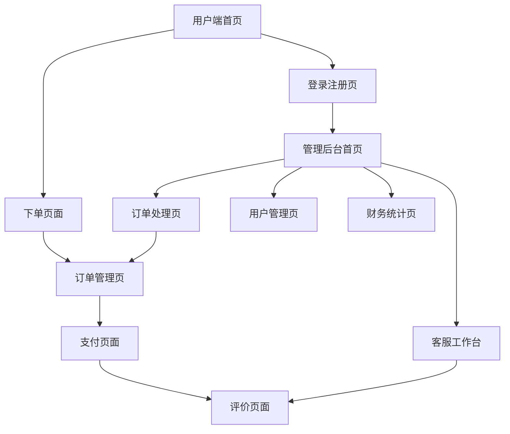

# 新干线闪修平台 - 产品需求文档

## 1. Product Overview
新干线闪修平台是一个专为XGX店内部维修业务设计的B/S架构订单管理系统，旨在解决用户下单困难、维修流程不透明、数据统计困难等问题。
- 核心目标：提供便捷的维修下单体验，建立透明的维修流程管理，实现统一的数据统计和财务管理。
- 目标用户：普通用户（下单方）、维修员、管理员、客服人员、财务人员。
- 市场价值：提升维修服务效率，增强用户体验，实现业务数字化转型。

## 2. Core Features

### 2.1 User Roles

| Role | Registration Method | Core Permissions |
|------|---------------------|------------------|
| 普通用户 | 手机号注册（后期支持验证码） | 下单、查看订单状态、支付、评价、售后 |
| 维修员 | 管理员邀请注册 | 接单、更新订单状态、跟踪订单进度 |
| 管理员 | 系统预设账号 | 全系统管理、订单分配、用户权限管理、数据统计 |
| 客服人员 | 管理员分配账号 | 查看订单、处理用户反馈、投诉处理 |
| 财务人员 | 管理员分配账号 | 查看流水、财务报表、活跃度统计 |

### 2.2 Feature Module

我们的新干线闪修平台包含以下主要页面：
1. **用户端首页**：服务展示、快速下单入口、订单状态查询
2. **登录注册页**：用户身份验证、角色区分登录
3. **下单页面**：维修内容填写、服务项目选择、故障描述
4. **订单管理页**：订单列表、状态跟踪、历史记录
5. **支付页面**：订单支付、支付状态确认
6. **评价页面**：服务评价、反馈提交
7. **管理后台首页**：数据大屏、统计图表、系统概览
8. **订单处理页**：订单分配、状态更新、进度跟踪
9. **用户管理页**：用户权限、角色管理、账号维护
10. **财务统计页**：收入统计、流水查看、报表生成
11. **客服工作台**：投诉处理、用户反馈、问题跟进

### 2.3 Page Details

| Page Name | Module Name | Feature description |
|-----------|-------------|---------------------|
| 用户端首页 | 服务展示区 | 展示主要维修服务项目，包含图标和简介 |
| 用户端首页 | 快速下单 | 提供快速下单按钮，引导用户进入下单流程 |
| 用户端首页 | 订单查询 | 支持订单号查询，显示订单当前状态 |
| 登录注册页 | 用户登录 | 手机号登录，支持角色自动识别跳转 |
| 登录注册页 | 用户注册 | 手机号注册，基本信息填写 |
| 下单页面 | 维修类型选择 | 选择维修内容或标准服务项目 |
| 下单页面 | 设备信息填写 | 设备型号、故障描述、图片上传 |
| 下单页面 | 时效选择 | 选择维修时效（着急/不着急） |
| 订单管理页 | 订单列表 | 显示用户所有订单，支持状态筛选 |
| 订单管理页 | 订单详情 | 查看订单详细信息、进度跟踪 |
| 支付页面 | 支付方式选择 | 支持多种支付方式（后期接入） |
| 支付页面 | 支付确认 | 订单金额确认、支付状态反馈 |
| 评价页面 | 服务评价 | 星级评价、文字评价、图片上传 |
| 评价页面 | 问题反馈 | 售后问题提交、投诉建议 |
| 管理后台首页 | 数据大屏 | 订单统计、收入统计、用户活跃度 |
| 管理后台首页 | 图表展示 | 折线图、柱状图显示业务趋势 |
| 订单处理页 | 订单分配 | 管理员分配订单给维修员 |
| 订单处理页 | 状态更新 | 维修员更新订单进度状态 |
| 订单处理页 | 订单转移 | 支持订单转移、放弃接单 |
| 用户管理页 | 权限管理 | 用户角色分配、权限设置 |
| 用户管理页 | 账号维护 | 用户信息管理、账号状态控制 |
| 财务统计页 | 收入统计 | 日/月/年收入统计、趋势分析 |
| 财务统计页 | 流水查看 | 详细流水记录、财务报表导出 |
| 客服工作台 | 投诉处理 | 用户投诉查看、处理状态跟踪 |
| 客服工作台 | 反馈管理 | 用户反馈收集、问题分类处理 |

## 3. Core Process

**普通用户流程：**
用户访问首页 → 选择服务类型 → 填写订单信息 → 提交订单 → 等待接单 → 确认报价 → 支付费用 → 跟踪维修进度 → 确认完成 → 评价服务

**维修员流程：**
登录系统 → 查看待接订单 → 选择接单 → 查看订单详情 → 联系用户确认 → 更新维修进度 → 完成维修 → 等待用户确认

**管理员流程：**
登录后台 → 查看系统概览 → 处理订单分配 → 监控维修进度 → 处理异常订单 → 查看统计报表 → 管理用户权限

**客服流程：**
登录系统 → 查看用户反馈 → 处理投诉问题 → 跟进问题解决 → 更新处理状态 → 用户满意度跟踪

**财务流程：**
登录系统 → 查看收入统计 → 核对流水记录 → 生成财务报表 → 分析业务数据 → 导出报表数据

## 4. User Interface Design

### 4.1 Design Style

- **主色调**：蓝色系 (#1890FF) 体现专业可靠，辅助色橙色 (#FF7A00) 突出重要操作
- **按钮样式**：圆角矩形按钮，主要按钮采用渐变效果，次要按钮为线框样式
- **字体**：中文使用微软雅黑，英文使用 Roboto，主标题 18px，正文 14px，辅助文字 12px
- **布局风格**：卡片式布局，顶部导航栏固定，左侧菜单可收缩（管理端）
- **图标风格**：线性图标风格，配合少量面性图标，支持深色/浅色主题切换

### 4.2 Page Design Overview

| Page Name | Module Name | UI Elements |
|-----------|-------------|-------------|
| 用户端首页 | 服务展示区 | 网格布局，每个服务项目使用卡片展示，包含图标、标题、简介，悬停效果 |
| 用户端首页 | 快速下单 | 醒目的橙色按钮，固定在页面右下角，圆形浮动按钮样式 |
| 登录注册页 | 登录表单 | 居中布局，白色卡片背景，输入框采用下划线样式，登录按钮全宽度 |
| 下单页面 | 表单区域 | 分步骤表单，进度条显示当前步骤，每个步骤使用卡片分隔 |
| 订单管理页 | 订单列表 | 时间线样式布局，每个订单显示状态标签，支持状态筛选标签页 |
| 管理后台首页 | 数据大屏 | 深色主题，大数字显示关键指标，图表使用蓝色渐变配色 |
| 订单处理页 | 订单卡片 | 看板式布局，订单按状态分列显示，支持拖拽操作 |

### 4.3 Responsiveness

系统采用移动端优先的响应式设计，确保在手机、平板、桌面端都有良好体验。用户端重点优化移动端体验，管理端同时兼顾桌面端和移动端操作便利性。支持触摸手势操作，包括滑动、长按等交互方式。