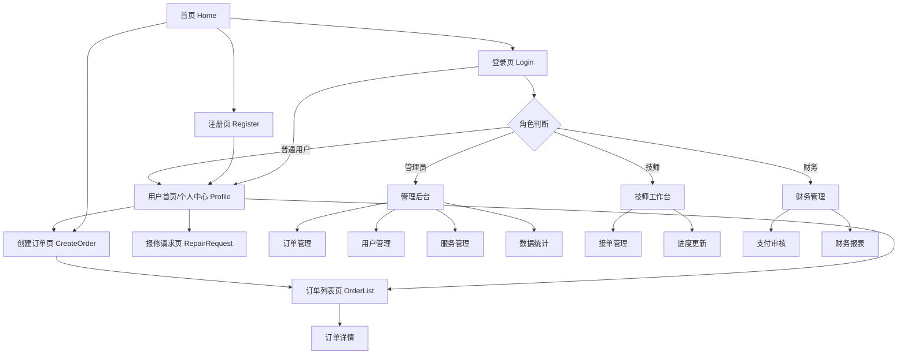

# 新干线闪修平台 - 产品需求文档

## 1. 产品概述
新干线闪修平台是一个现代化的设备维修服务平台，连接需要维修服务的用户和专业的维修技师。平台采用React+Express+Supabase技术栈，提供完整的维修服务流程管理，从用户下单到维修完成的全程跟踪。

平台主要解决传统维修行业信息不透明、服务质量参差不齐、用户体验差等问题，为用户提供便捷、透明、高质量的维修服务体验。支持手机、电脑等多种设备的维修服务，包括屏幕维修、电池更换、系统重装、数据恢复等多种服务类型。

目标是打造一个高效、可信赖的维修服务生态系统，提升整个维修行业的服务水平和用户满意度，成为用户首选的设备维修服务平台。

## 2. Core Features

### 2.1 用户角色

| 角色 | 注册方式 | 核心权限 |
|------|----------|----------|
| 普通用户 (user) | 手机号+密码注册 | 浏览服务项目、创建维修订单、查看订单状态、在线支付、服务评价、个人信息管理 |
| 维修技师 (technician) | 管理员分配账号 | 接收订单分配、更新维修进度、上传维修照片、完成订单、查看收入统计 |
| 管理员 (admin) | 系统预设账号 | 全系统管理权限、用户管理、订单管理、服务项目管理、技师分配、数据统计分析 |
| 财务人员 (finance) | 管理员分配账号 | 订单财务审核、支付状态管理、收款确认、财务报表查看、退款处理 |

### 2.2 功能模块

我们的维修平台需求包含以下主要页面：
1. **首页 (Home)**：平台介绍、服务项目展示、快速下单入口、用户导航
2. **用户认证页面**：用户登录 (Login)、用户注册 (Register)
3. **订单管理页面**：创建订单 (CreateOrder)、订单列表 (OrderList)、报修请求 (RepairRequest)
4. **个人中心页面 (Profile)**：用户信息管理、订单历史、账户设置
5. **管理后台功能**：订单管理、用户管理、服务项目管理、数据统计分析

### 2.3 页面详情

| 页面名称 | 模块名称 | 功能描述 |
|----------|----------|----------|
| 首页 (Home) | 导航栏 | 显示平台Logo、主要功能入口、用户登录状态、角色识别 |
| 首页 (Home) | 服务展示区 | 展示维修服务类型（手机维修、电脑维修、数据服务）、价格信息、服务特色 |
| 首页 (Home) | 快速下单入口 | 提供快速下单按钮，引导用户进入订单创建流程 |
| 登录页 (Login) | 用户认证 | 手机号+密码登录、表单验证、角色自动识别、登录状态管理 |
| 注册页 (Register) | 用户注册 | 基本信息填写（姓名、手机、邮箱）、密码设置、角色选择、表单验证 |
| 创建订单页 (CreateOrder) | 服务选择 | 选择维修服务类型、查看服务详情和基础价格、预估时长 |
| 创建订单页 (CreateOrder) | 设备信息填写 | 填写设备类型、设备型号、故障描述、紧急程度选择 |
| 创建订单页 (CreateOrder) | 联系信息 | 填写联系地址、联系电话、预约时间选择 |
| 订单列表页 (OrderList) | 订单筛选 | 按状态（待处理、进行中、已完成、已取消）、时间范围筛选 |
| 订单列表页 (OrderList) | 订单展示 | 显示订单号、服务类型、状态、创建时间、操作按钮（查看详情、取消订单） |
| 订单列表页 (OrderList) | 订单操作 | 查看订单详情、取消订单、联系技师、订单评价 |
| 报修请求页 (RepairRequest) | 快速报修 | 简化的报修流程、常见问题选择、紧急报修处理 |
| 个人中心页 (Profile) | 用户信息管理 | 显示和编辑用户基本信息、头像上传、密码修改 |
| 个人中心页 (Profile) | 订单历史 | 查看历史订单、订单统计、重新下单、服务评价 |
| 个人中心页 (Profile) | 账户设置 | 通知设置、隐私设置、账户安全设置 |
| 管理后台 | 订单管理 | 订单列表查看、状态批量更新、技师分配、订单详情管理 |
| 管理后台 | 用户管理 | 用户列表、角色权限管理、账号状态控制、用户信息编辑 |
| 管理后台 | 服务管理 | 服务项目管理、价格设置、服务分类管理、服务状态控制 |
| 管理后台 | 数据统计 | 订单统计分析、收入报表、用户活跃度分析、技师工作量统计 |

## 3. 核心流程

### 普通用户流程
1. 用户注册/登录 → 浏览首页服务项目 → 选择维修服务类型 → 创建订单（填写设备信息、故障描述、联系信息） → 选择紧急程度和预约时间 → 提交订单 → 等待管理员分配技师 → 跟踪订单状态 → 确认维修完成 → 在线支付 → 服务评价

### 维修技师流程
1. 登录系统 → 查看分配给自己的订单 → 接受订单任务 → 联系用户确认维修时间和地点 → 开始维修工作 → 实时更新维修进度状态 → 上传维修过程照片 → 完成维修并更新订单状态 → 等待用户确认和支付 → 查看收入统计

### 管理员流程
1. 登录管理后台 → 查看订单总览和统计数据 → 将新订单分配给合适的技师 → 监控所有订单进度 → 处理异常和投诉订单 → 管理用户权限和角色 → 管理服务项目和价格 → 查看平台数据统计和业务报表

### 财务人员流程
1. 登录财务管理系统 → 查看待审核的支付订单 → 确认收款状态和金额 → 处理退款申请和纠纷 → 生成财务报表和收入统计 → 核对平台账务信息 → 监控支付异常情况

## 4. 用户界面设计

### 4.1 设计风格

- **主色调**：蓝色系 (#1890ff) 作为主色，传达专业和可信赖感
- **辅助色**：灰色系 (#f0f2f5) 作为背景色，绿色 (#52c41a) 作为成功状态色，红色 (#ff4d4f) 作为错误/紧急状态色
- **按钮样式**：圆角按钮设计，主要按钮使用主色调，次要按钮使用边框样式，危险操作使用红色
- **字体**：系统默认字体栈，标题使用 16-24px，正文使用 14px，辅助文字使用 12px
- **布局风格**：基于 Ant Design 的卡片式布局，清晰的层次结构，充足的留白空间
- **图标风格**：使用 Ant Design Icons，线性图标风格，保持视觉一致性
- **动画效果**：使用 CSS Transitions 和 Ant Design 动画，提升用户体验

### 4.2 页面设计概览

| 页面名称 | 模块名称 | UI元素 |
|----------|----------|--------|
| 首页 (Home) | 导航栏 | Logo居左，导航菜单居中，用户登录状态居右，白色背景，阴影分割 |
| 首页 (Home) | 服务展示区 | 网格卡片布局，每个服务类型一个卡片，包含图标、标题、描述、基础价格、预估时长 |
| 首页 (Home) | 快速下单入口 | 醒目的主色调按钮，居中放置，带有引导文字和图标 |
| 登录页 (Login) | 登录表单 | 居中布局，白色卡片背景，表单字段垂直排列，主色调登录按钮，表单验证提示 |
| 注册页 (Register) | 注册表单 | 多步骤表单设计，字段清晰标注，实时验证反馈，角色选择下拉框 |
| 创建订单页 (CreateOrder) | 步骤指示器 | 顶部显示当前步骤，使用 Ant Design Steps 组件，清晰的进度指示 |
| 创建订单页 (CreateOrder) | 表单区域 | 分步骤表单，每步一个卡片，必填项标红星，紧急程度用颜色区分 |
| 订单列表页 (OrderList) | 筛选器 | 顶部筛选栏，状态标签、时间范围选择器，搜索框 |
| 订单列表页 (OrderList) | 订单卡片 | 每个订单一个卡片，订单号、服务类型、状态标签，操作按钮组 |
| 报修请求页 (RepairRequest) | 快速表单 | 简化的单页表单，常见问题快选，紧急报修红色高亮 |
| 个人中心页 (Profile) | 用户信息卡片 | 头像上传区域，基本信息展示和编辑，密码修改独立区域 |
| 个人中心页 (Profile) | 订单历史 | 表格或卡片列表，订单统计图表，快速操作按钮 |
| 管理后台 | 侧边导航 | 深蓝色背景，白色文字，当前页面高亮，折叠功能 |
| 管理后台 | 数据仪表板 | 统计卡片网格布局，图表组件，实时数据更新 |
| 管理后台 | 数据表格 | Ant Design Table 组件，分页、排序、筛选功能，批量操作 |

### 4.3 响应式设计

平台采用移动优先的响应式设计，基于 Tailwind CSS 断点：
- **移动端**：< 768px，单列布局，底部导航，触摸优化，手势支持
- **平板端**：768px - 1024px，两列布局，侧边栏可折叠，触摸和鼠标双重支持
- **桌面端**：> 1024px，多列布局，固定侧边栏，鼠标悬停效果，键盘快捷键支持
- **超宽屏**：> 1440px，最大内容宽度限制，居中布局，充分利用屏幕空间