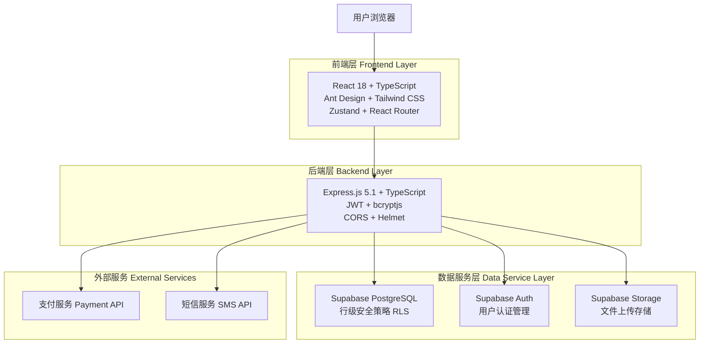
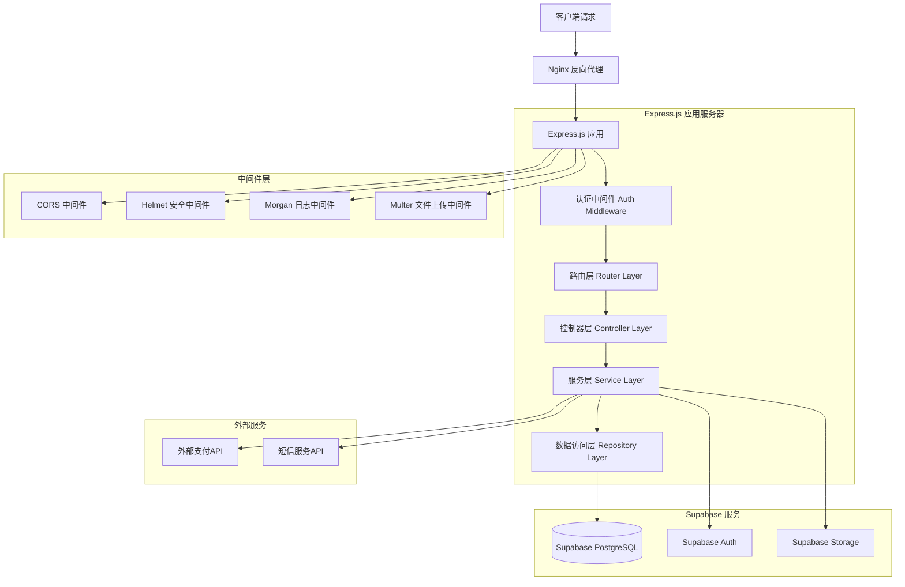
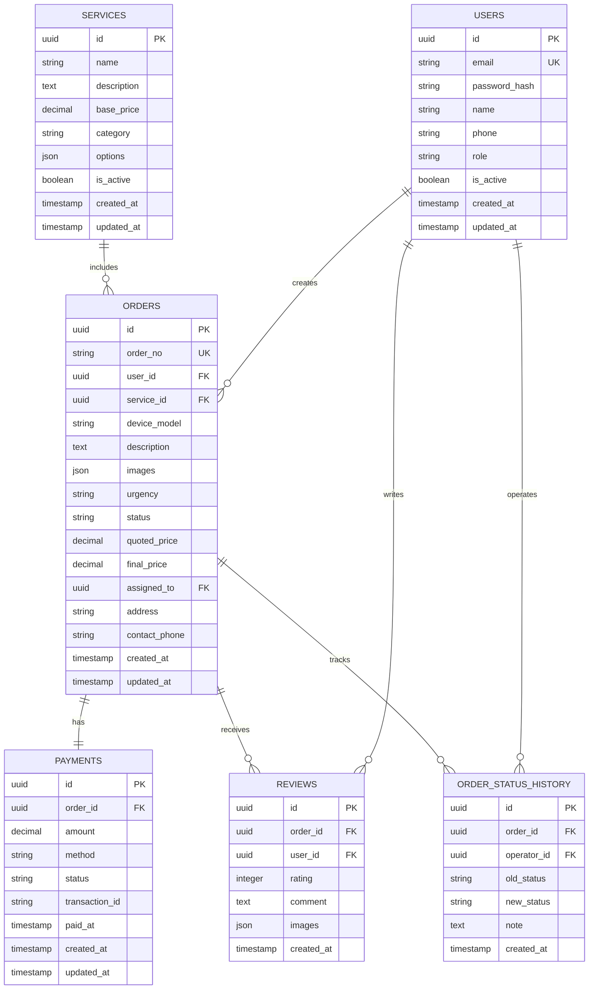

# 新干线闪修平台 - 技术架构文档

## 1.架构设计



## 2. Technology Description

### 前端技术栈
- **React 18.3.1**: 现代化的用户界面框架，支持并发特性和自动批处理
- **TypeScript 5.8.3**: 类型安全的JavaScript超集，提供更好的开发体验
- **Ant Design 5.26.7**: 企业级UI设计语言和组件库
- **Tailwind CSS 4.1.11**: 实用优先的CSS框架，快速构建自定义设计
- **React Router DOM 7.8.0**: 声明式路由管理，支持嵌套路由和代码分割
- **Zustand 5.0.7**: 轻量级状态管理库，简单易用
- **Axios 1.11.0**: 基于Promise的HTTP客户端
- **Vite 7.1.0**: 快速的构建工具和开发服务器

#### 当前实现状态
- ✅ **用户认证流程**: 完整的登录、注册、JWT认证机制
- ✅ **路由保护**: 基于角色的路由访问控制
- ✅ **状态管理**: 使用Zustand管理用户、订单、服务等状态
- ✅ **响应式设计**: 支持桌面端和移动端适配
- ✅ **组件化开发**: 可复用的业务组件和通用组件
- 🟡 **错误处理**: 基础错误边界，待完善全局错误处理
- 🟡 **性能优化**: 基础代码分割，待添加更多优化策略

### 后端技术栈
- **Express.js 5.1.0**: 快速、极简的Node.js Web应用框架
- **TypeScript 5.9.2**: 服务端类型安全开发
- **Supabase 2.54.0**: 开源的Firebase替代方案，提供数据库、认证、存储服务
- **JWT (jsonwebtoken 9.0.2)**: JSON Web Token用于用户认证
- **bcryptjs 3.0.2**: 密码哈希加密库
- **CORS 2.8.5**: 跨域资源共享中间件
- **Helmet 8.1.0**: 安全中间件，设置各种HTTP头
- **Morgan 1.10.1**: HTTP请求日志中间件
- **Multer 2.0.2**: 文件上传处理中间件

#### 当前实现状态
- ✅ **RESTful API**: 完整的用户、订单、服务管理API
- ✅ **身份认证**: JWT token认证和角色权限控制
- ✅ **数据验证**: 请求参数验证和错误处理
- ✅ **安全防护**: CORS、Helmet安全头设置
- ✅ **日志记录**: HTTP请求日志和错误日志
- 🟡 **文件上传**: 基础Multer配置，待完善图片处理
- 🟡 **缓存机制**: 待实现Redis缓存
- 🔴 **支付集成**: 待实现第三方支付接口

### 数据库和服务
- **PostgreSQL**: 通过Supabase提供的关系型数据库
- **Supabase Auth**: 用户认证和授权服务
- **Supabase Storage**: 文件上传和存储服务
- **行级安全策略 (RLS)**: 数据库级别的安全控制
- **Docker + Nginx**: 容器化部署和反向代理

## 3.路由定义

### 前端路由 (React Router)

| 路由 | 页面组件 | 用途 | 权限要求 |
|------|----------|------|----------|
| `/` | Home | 首页，展示服务列表和平台介绍 | 公开访问 |
| `/login` | Login | 用户登录页面 | 未登录用户 |
| `/register` | Register | 用户注册页面 | 未登录用户 |
| `/repair-request` | RepairRequest | 报修请求页面，用户提交维修需求 | 需要登录 |
| `/profile` | Profile | 用户个人中心，查看和编辑个人信息 | 需要登录 |
| `/orders` | Orders | 订单管理页面，查看订单历史和状态 | 需要登录 |
| `/order/:id` | OrderDetail | 订单详情页面，查看具体订单信息 | 需要登录 |
| `/technician` | TechnicianDashboard | 技师工作台，管理分配的订单 | 技师权限 |
| `/technician/orders` | TechnicianOrders | 技师订单列表 | 技师权限 |
| `/admin` | AdminDashboard | 管理员后台首页，数据概览 | 管理员权限 |
| `/admin/users` | AdminUsers | 用户管理页面 | 管理员权限 |
| `/admin/orders` | AdminOrders | 订单管理页面 | 管理员权限 |
| `/admin/services` | AdminServices | 服务管理页面 | 管理员权限 |
| `/admin/technicians` | AdminTechnicians | 技师管理页面 | 管理员权限 |
| `/finance` | FinanceDashboard | 财务管理页面 | 财务权限 |
| `*` | NotFound | 404错误页面 | 公开访问 |

## 4.API定义

### 4.1 认证相关 API

**用户登录**
```
POST /api/auth/login
```

Request:
| 参数名 | 类型 | 必填 | 描述 |
|--------|------|------|------|
| email | string | true | 用户邮箱 |
| password | string | true | 用户密码 |

Response:
```json
{
  "success": true,
  "data": {
    "token": "eyJhbGciOiJIUzI1NiIsInR5cCI6IkpXVCJ9...",
    "user": {
      "id": "uuid",
      "email": "user@example.com",
      "name": "用户姓名",
      "role": "user"
    }
  }
}
```

**用户注册**
```
POST /api/auth/register
```

Request:
| 参数名 | 类型 | 必填 | 描述 |
|--------|------|------|------|
| email | string | true | 用户邮箱 |
| password | string | true | 用户密码 |
| name | string | true | 用户姓名 |
| phone | string | false | 手机号码 |

**用户登出**
```
POST /api/auth/logout
```

**获取用户信息**
```
GET /api/auth/me
```
Headers: `Authorization: Bearer <token>`

### 4.2 订单管理 API

**创建订单**
```
POST /api/orders
```
Headers: `Authorization: Bearer <token>`

Request:
| 参数名 | 类型 | 必填 | 描述 |
|--------|------|------|------|
| service_id | string | true | 服务类型ID |
| device_model | string | false | 设备型号 |
| description | string | true | 故障描述 |
| images | array | false | 故障图片URL数组 |
| urgency | string | false | 紧急程度 (normal/urgent/emergency) |
| address | string | true | 维修地址 |
| contact_phone | string | true | 联系电话 |

Response:
```json
{
  "success": true,
  "data": {
    "id": "uuid",
    "order_no": "XGX202412001",
    "status": "pending",
    "created_at": "2024-12-01T10:00:00Z"
  }
}
```

**获取订单列表**
```
GET /api/orders
```
Headers: `Authorization: Bearer <token>`

Query Parameters:
| 参数名 | 类型 | 必填 | 描述 |
|--------|------|------|------|
| status | string | false | 订单状态筛选 |
| page | number | false | 页码，默认1 |
| limit | number | false | 每页数量，默认10 |

**获取订单详情**
```
GET /api/orders/:id
```
Headers: `Authorization: Bearer <token>`

**更新订单状态**
```
PUT /api/orders/:id/status
```
Headers: `Authorization: Bearer <token>`

Request:
| 参数名 | 类型 | 必填 | 描述 |
|--------|------|------|------|
| status | string | true | 新状态 |
| note | string | false | 状态变更备注 |

### 4.3 服务管理 API

**获取服务列表**
```
GET /api/services
```

Query Parameters:
| 参数名 | 类型 | 必填 | 描述 |
|--------|------|------|------|
| category | string | false | 服务分类筛选 |
| active | boolean | false | 是否启用 |

**创建服务**
```
POST /api/services
```
Headers: `Authorization: Bearer <token>` (管理员权限)

Request:
| 参数名 | 类型 | 必填 | 描述 |
|--------|------|------|------|
| name | string | true | 服务名称 |
| description | string | true | 服务描述 |
| base_price | number | true | 基础价格 |
| category | string | true | 服务分类 |
| options | object | false | 服务选项配置 |

### 4.4 用户管理 API

**获取用户列表**
```
GET /api/users
```
Headers: `Authorization: Bearer <token>` (管理员权限)

Query Parameters:
| 参数名 | 类型 | 必填 | 描述 |
|--------|------|------|------|
| role | string | false | 用户角色筛选 |
| page | number | false | 页码 |
| limit | number | false | 每页数量 |

**更新用户角色**
```
PUT /api/users/:id/role
```
Headers: `Authorization: Bearer <token>` (管理员权限)

Request:
| 参数名 | 类型 | 必填 | 描述 |
|--------|------|------|------|
| role | string | true | 新角色 (user/technician/admin/finance) |

### 4.5 支付相关 API

**创建支付**
```
POST /api/payments
```
Headers: `Authorization: Bearer <token>`

Request:
| 参数名 | 类型 | 必填 | 描述 |
|--------|------|------|------|
| order_id | string | true | 订单ID |
| amount | number | true | 支付金额 |
| method | string | true | 支付方式 (alipay/wechat/bank) |

Response:
```json
{
  "success": true,
  "data": {
    "payment_id": "uuid",
    "payment_url": "https://payment.example.com/pay/xxx",
    "qr_code": "data:image/png;base64,xxx"
  }
}
```

## 5.服务器架构图



## 6.数据模型

### 6.1 数据模型定义



### 6.2 数据定义语言 (DDL)

**用户表 (users)**
```sql
-- 创建用户表
CREATE TABLE users (
    id UUID PRIMARY KEY DEFAULT gen_random_uuid(),
    email VARCHAR(255) UNIQUE NOT NULL,
    password_hash VARCHAR(255) NOT NULL,
    name VARCHAR(100) NOT NULL,
    phone VARCHAR(20),
    role VARCHAR(20) DEFAULT 'user' CHECK (role IN ('user', 'technician', 'admin', 'finance')),
    is_active BOOLEAN DEFAULT true,
    created_at TIMESTAMP WITH TIME ZONE DEFAULT NOW(),
    updated_at TIMESTAMP WITH TIME ZONE DEFAULT NOW()
);

-- 创建索引
CREATE INDEX idx_users_email ON users(email);
CREATE INDEX idx_users_role ON users(role);
CREATE INDEX idx_users_phone ON users(phone);

-- 创建更新时间触发器
CREATE OR REPLACE FUNCTION update_updated_at_column()
RETURNS TRIGGER AS $$
BEGIN
    NEW.updated_at = NOW();
    RETURN NEW;
END;
$$ language 'plpgsql';

CREATE TRIGGER update_users_updated_at BEFORE UPDATE ON users
    FOR EACH ROW EXECUTE FUNCTION update_updated_at_column();

-- 行级安全策略
ALTER TABLE users ENABLE ROW LEVEL SECURITY;

-- 权限设置
GRANT SELECT ON users TO anon;
GRANT ALL PRIVILEGES ON users TO authenticated;

-- 初始化管理员用户
INSERT INTO users (email, password_hash, name, role) VALUES
('admin@xgx.com', '$2b$10$example_hash', '系统管理员', 'admin'),
('finance@xgx.com', '$2b$10$example_hash', '财务管理员', 'finance');
```

**服务项目表 (services)**
```sql
-- 创建服务项目表
CREATE TABLE services (
    id UUID PRIMARY KEY DEFAULT gen_random_uuid(),
    name VARCHAR(100) NOT NULL,
    description TEXT,
    base_price DECIMAL(10,2) DEFAULT 0,
    category VARCHAR(50) DEFAULT 'other',
    options JSONB DEFAULT '{}',
    is_active BOOLEAN DEFAULT true,
    created_at TIMESTAMP WITH TIME ZONE DEFAULT NOW(),
    updated_at TIMESTAMP WITH TIME ZONE DEFAULT NOW()
);

-- 创建索引
CREATE INDEX idx_services_active ON services(is_active);
CREATE INDEX idx_services_category ON services(category);

-- 创建更新时间触发器
CREATE TRIGGER update_services_updated_at BEFORE UPDATE ON services
    FOR EACH ROW EXECUTE FUNCTION update_updated_at_column();

-- 行级安全策略
ALTER TABLE services ENABLE ROW LEVEL SECURITY;

-- 初始化数据
INSERT INTO services (name, description, base_price, category, options) VALUES
('屏幕维修', '手机/平板屏幕更换维修', 150.00, 'screen', '{"devices": ["手机", "平板"], "warranty": "3个月"}'),
('电池更换', '设备电池更换服务', 80.00, 'battery', '{"devices": ["手机", "笔记本"], "warranty": "6个月"}'),
('系统重装', '电脑系统重新安装，包含驱动安装', 50.00, 'system', '{"includes": ["系统安装", "驱动安装", "基础软件"]}'),
('数据恢复', '硬盘/存储设备数据恢复', 200.00, 'data', '{"success_rate": "85%", "time": "1-3天"}'),
('清灰服务', '电脑内部清灰，提升散热效果', 30.00, 'maintenance', '{"liquid_metal": {"price": 20, "description": "液金导热"}}'),
('软件安装', '常用软件安装配置', 20.00, 'software', '{}'),
('进水维修', '设备进水处理和维修', 100.00, 'water_damage', '{"success_rate": "70%", "time": "2-5天"});

-- 权限设置
GRANT SELECT ON services TO anon;
GRANT ALL PRIVILEGES ON services TO authenticated;
```

**订单表 (orders)**
```sql
-- 创建订单表
CREATE TABLE orders (
    id UUID PRIMARY KEY DEFAULT gen_random_uuid(),
    order_no VARCHAR(50) UNIQUE NOT NULL,
    user_id UUID NOT NULL REFERENCES users(id),
    service_id UUID REFERENCES services(id),
    device_model VARCHAR(100),
    description TEXT NOT NULL,
    images JSONB DEFAULT '[]',
    urgency VARCHAR(20) DEFAULT 'normal' CHECK (urgency IN ('urgent', 'normal', 'emergency')),
    status VARCHAR(20) DEFAULT 'pending' CHECK (status IN ('pending', 'quoted', 'paid', 'assigned', 'processing', 'completed', 'cancelled')),
    quoted_price DECIMAL(10,2),
    final_price DECIMAL(10,2),
    assigned_to UUID REFERENCES users(id),
    address TEXT NOT NULL,
    contact_phone VARCHAR(20) NOT NULL,
    created_at TIMESTAMP WITH TIME ZONE DEFAULT NOW(),
    updated_at TIMESTAMP WITH TIME ZONE DEFAULT NOW()
);

-- 创建索引
CREATE INDEX idx_orders_user_id ON orders(user_id);
CREATE INDEX idx_orders_service_id ON orders(service_id);
CREATE INDEX idx_orders_status ON orders(status);
CREATE INDEX idx_orders_assigned_to ON orders(assigned_to);
CREATE INDEX idx_orders_created_at ON orders(created_at DESC);
CREATE INDEX idx_orders_order_no ON orders(order_no);

-- 创建更新时间触发器
CREATE TRIGGER update_orders_updated_at BEFORE UPDATE ON orders
    FOR EACH ROW EXECUTE FUNCTION update_updated_at_column();

-- 行级安全策略
ALTER TABLE orders ENABLE ROW LEVEL SECURITY;

-- 创建订单号生成函数
CREATE OR REPLACE FUNCTION generate_order_no()
RETURNS TEXT AS $$
DECLARE
    new_order_no TEXT;
BEGIN
    new_order_no := 'XGX' || TO_CHAR(NOW(), 'YYYYMMDD') || LPAD(NEXTVAL('order_no_seq')::TEXT, 3, '0');
    RETURN new_order_no;
END;
$$ LANGUAGE plpgsql;

-- 创建序列
CREATE SEQUENCE IF NOT EXISTS order_no_seq START 1;

-- 权限设置
GRANT SELECT ON orders TO anon;
GRANT ALL PRIVILEGES ON orders TO authenticated;
```

**支付表 (payments)**
```sql
-- 创建支付表
CREATE TABLE payments (
    id UUID PRIMARY KEY DEFAULT gen_random_uuid(),
    order_id UUID NOT NULL UNIQUE,
    amount DECIMAL(10,2) NOT NULL,
    method VARCHAR(50) NOT NULL,
    status VARCHAR(20) DEFAULT 'pending' CHECK (status IN ('pending', 'completed', 'failed', 'refunded')),
    transaction_id VARCHAR(100),
    paid_at TIMESTAMP WITH TIME ZONE,
    created_at TIMESTAMP WITH TIME ZONE DEFAULT NOW()
);

-- 创建索引
CREATE INDEX idx_payments_order_id ON payments(order_id);
CREATE INDEX idx_payments_status ON payments(status);

-- 权限设置
GRANT SELECT ON payments TO anon;
GRANT ALL PRIVILEGES ON payments TO authenticated;
```

**评价表 (reviews)**
```sql
-- 创建评价表
CREATE TABLE reviews (
    id UUID PRIMARY KEY DEFAULT gen_random_uuid(),
    order_id UUID NOT NULL UNIQUE,
    user_id UUID NOT NULL,
    rating INTEGER NOT NULL CHECK (rating >= 1 AND rating <= 5),
    comment TEXT,
    images JSONB DEFAULT '[]',
    created_at TIMESTAMP WITH TIME ZONE DEFAULT NOW()
);

-- 创建索引
CREATE INDEX idx_reviews_order_id ON reviews(order_id);
CREATE INDEX idx_reviews_rating ON reviews(rating);

-- 权限设置
GRANT SELECT ON reviews TO anon;
GRANT ALL PRIVILEGES ON reviews TO authenticated;
```

**订单日志表 (order_logs)**
```sql
-- 创建订单日志表
CREATE TABLE order_logs (
    id UUID PRIMARY KEY DEFAULT gen_random_uuid(),
    order_id UUID NOT NULL,
    operator_id UUID NOT NULL,
    action VARCHAR(50) NOT NULL,
    description TEXT,
    created_at TIMESTAMP WITH TIME ZONE DEFAULT NOW()
);

-- 创建索引
CREATE INDEX idx_order_logs_order_id ON order_logs(order_id);
CREATE INDEX idx_order_logs_created_at ON order_logs(created_at DESC);

-- 权限设置
GRANT SELECT ON order_logs TO anon;
GRANT ALL PRIVILEGES ON order_logs TO authenticated;
```