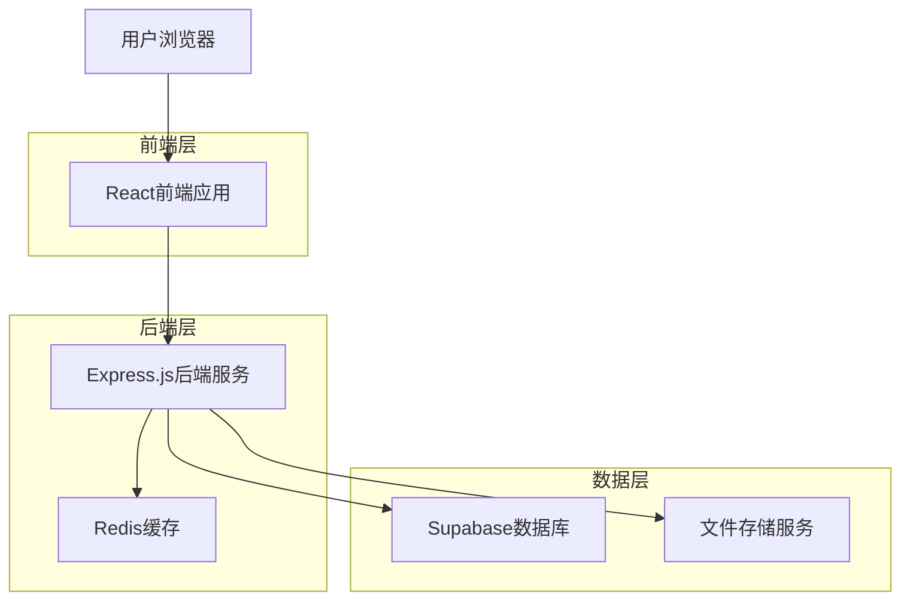
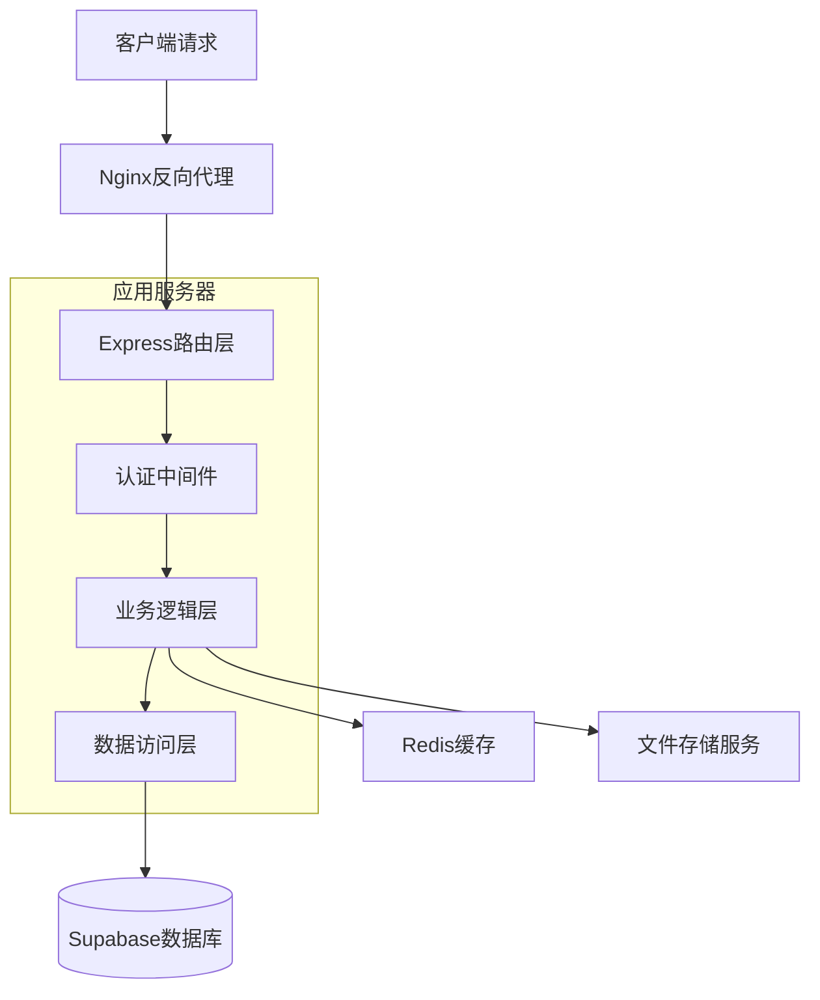
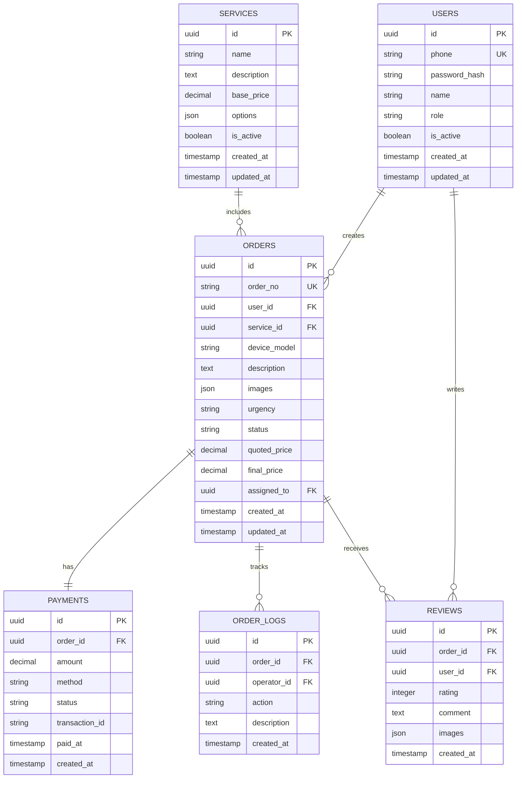

# 新干线闪修平台 - 技术架构文档

## 1. Architecture design



## 2. Technology Description

- Frontend: React@18 + TypeScript + Ant Design + Vite + React Router
- Backend: Express@4 + TypeScript + JWT认证
- Database: Supabase (PostgreSQL)
- Cache: Redis@7
- File Storage: Supabase Storage
- Deployment: Docker + Nginx

## 3. Route definitions

| Route | Purpose |
|-------|---------|
| / | 用户端首页，展示服务项目和快速下单入口 |
| /login | 登录页面，支持多角色登录 |
| /register | 用户注册页面 |
| /order/create | 创建订单页面，填写维修信息 |
| /order/list | 订单列表页面，查看历史订单 |
| /order/:id | 订单详情页面，跟踪订单状态 |
| /payment/:orderId | 支付页面，处理订单支付 |
| /review/:orderId | 评价页面，服务评价和反馈 |
| /admin | 管理后台首页，数据大屏 |
| /admin/orders | 订单管理页面，处理和分配订单 |
| /admin/users | 用户管理页面，权限和角色管理 |
| /admin/finance | 财务统计页面，收入和流水统计 |
| /admin/service | 客服工作台，处理投诉和反馈 |

## 4. API definitions

### 4.1 Core API

**用户认证相关**
```
POST /api/auth/login
```

Request:
| Param Name| Param Type  | isRequired  | Description |
|-----------|-------------|-------------|-------------|
| phone     | string      | true        | 用户手机号 |
| password  | string      | true        | 用户密码 |
| role      | string      | false       | 用户角色类型 |

Response:
| Param Name| Param Type  | Description |
|-----------|-------------|-------------|
| success   | boolean     | 登录是否成功 |
| token     | string      | JWT认证令牌 |
| user      | object      | 用户基本信息 |

**订单管理相关**
```
POST /api/orders
```

Request:
| Param Name    | Param Type  | isRequired  | Description |
|---------------|-------------|-------------|-------------|
| serviceType   | string      | true        | 服务类型 |
| deviceModel   | string      | false       | 设备型号 |
| description   | string      | true        | 故障描述 |
| images        | array       | false       | 故障图片 |
| urgency       | string      | false       | 时效要求 |

Response:
| Param Name| Param Type  | Description |
|-----------|-------------|-------------|
| success   | boolean     | 创建是否成功 |
| orderId   | string      | 订单ID |
| orderNo   | string      | 订单编号 |

```
GET /api/orders
```

Request:
| Param Name| Param Type  | isRequired  | Description |
|-----------|-------------|-------------|-------------|
| status    | string      | false       | 订单状态筛选 |
| page      | number      | false       | 页码 |
| limit     | number      | false       | 每页数量 |

Response:
| Param Name| Param Type  | Description |
|-----------|-------------|-------------|
| success   | boolean     | 请求是否成功 |
| data      | array       | 订单列表 |
| total     | number      | 总数量 |

**支付相关**
```
POST /api/payment/create
```

Request:
| Param Name| Param Type  | isRequired  | Description |
|-----------|-------------|-------------|-------------|
| orderId   | string      | true        | 订单ID |
| amount    | number      | true        | 支付金额 |
| method    | string      | true        | 支付方式 |

Response:
| Param Name| Param Type  | Description |
|-----------|-------------|-------------|
| success   | boolean     | 创建是否成功 |
| paymentId | string      | 支付ID |
| paymentUrl| string      | 支付链接 |

## 5. Server architecture diagram



## 6. Data model

### 6.1 Data model definition



### 6.2 Data Definition Language

**用户表 (users)**
```sql
-- 创建用户表
CREATE TABLE users (
    id UUID PRIMARY KEY DEFAULT gen_random_uuid(),
    phone VARCHAR(20) UNIQUE NOT NULL,
    password_hash VARCHAR(255) NOT NULL,
    name VARCHAR(100) NOT NULL,
    role VARCHAR(20) DEFAULT 'user' CHECK (role IN ('user', 'technician', 'admin', 'service', 'finance')),
    is_active BOOLEAN DEFAULT true,
    created_at TIMESTAMP WITH TIME ZONE DEFAULT NOW(),
    updated_at TIMESTAMP WITH TIME ZONE DEFAULT NOW()
);

-- 创建索引
CREATE INDEX idx_users_phone ON users(phone);
CREATE INDEX idx_users_role ON users(role);

-- 权限设置
GRANT SELECT ON users TO anon;
GRANT ALL PRIVILEGES ON users TO authenticated;
```

**服务项目表 (services)**
```sql
-- 创建服务项目表
CREATE TABLE services (
    id UUID PRIMARY KEY DEFAULT gen_random_uuid(),
    name VARCHAR(100) NOT NULL,
    description TEXT,
    base_price DECIMAL(10,2) DEFAULT 0,
    options JSONB DEFAULT '{}',
    is_active BOOLEAN DEFAULT true,
    created_at TIMESTAMP WITH TIME ZONE DEFAULT NOW(),
    updated_at TIMESTAMP WITH TIME ZONE DEFAULT NOW()
);

-- 创建索引
CREATE INDEX idx_services_active ON services(is_active);

-- 初始化数据
INSERT INTO services (name, description, base_price, options) VALUES
('系统重装', '电脑系统重新安装，包含驱动安装', 50.00, '{"includes": ["系统安装", "驱动安装", "基础软件"]}'),
('清灰服务', '电脑内部清灰，提升散热效果', 30.00, '{"liquid_metal": {"price": 20, "description": "液金导热"}}'),
('软件安装', '常用软件安装配置', 20.00, '{}'),
('电脑进水', '电脑进水处理和维修', 100.00, '{}'),
('手机电池更换', '手机电池更换服务', 80.00, '{}'),
('手机屏幕更换', '手机屏幕更换服务', 150.00, '{}'),
('系统维护', '系统优化和维护', 40.00, '{}');

-- 权限设置
GRANT SELECT ON services TO anon;
GRANT ALL PRIVILEGES ON services TO authenticated;
```

**订单表 (orders)**
```sql
-- 创建订单表
CREATE TABLE orders (
    id UUID PRIMARY KEY DEFAULT gen_random_uuid(),
    order_no VARCHAR(50) UNIQUE NOT NULL,
    user_id UUID NOT NULL,
    service_id UUID,
    device_model VARCHAR(100),
    description TEXT NOT NULL,
    images JSONB DEFAULT '[]',
    urgency VARCHAR(20) DEFAULT 'normal' CHECK (urgency IN ('urgent', 'normal')),
    status VARCHAR(20) DEFAULT 'pending' CHECK (status IN ('pending', 'quoted', 'paid', 'assigned', 'processing', 'completed', 'cancelled')),
    quoted_price DECIMAL(10,2),
    final_price DECIMAL(10,2),
    assigned_to UUID,
    created_at TIMESTAMP WITH TIME ZONE DEFAULT NOW(),
    updated_at TIMESTAMP WITH TIME ZONE DEFAULT NOW()
);

-- 创建索引
CREATE INDEX idx_orders_user_id ON orders(user_id);
CREATE INDEX idx_orders_status ON orders(status);
CREATE INDEX idx_orders_assigned_to ON orders(assigned_to);
CREATE INDEX idx_orders_created_at ON orders(created_at DESC);

-- 权限设置
GRANT SELECT ON orders TO anon;
GRANT ALL PRIVILEGES ON orders TO authenticated;
```

**支付表 (payments)**
```sql
-- 创建支付表
CREATE TABLE payments (
    id UUID PRIMARY KEY DEFAULT gen_random_uuid(),
    order_id UUID NOT NULL UNIQUE,
    amount DECIMAL(10,2) NOT NULL,
    method VARCHAR(50) NOT NULL,
    status VARCHAR(20) DEFAULT 'pending' CHECK (status IN ('pending', 'completed', 'failed', 'refunded')),
    transaction_id VARCHAR(100),
    paid_at TIMESTAMP WITH TIME ZONE,
    created_at TIMESTAMP WITH TIME ZONE DEFAULT NOW()
);

-- 创建索引
CREATE INDEX idx_payments_order_id ON payments(order_id);
CREATE INDEX idx_payments_status ON payments(status);

-- 权限设置
GRANT SELECT ON payments TO anon;
GRANT ALL PRIVILEGES ON payments TO authenticated;
```

**评价表 (reviews)**
```sql
-- 创建评价表
CREATE TABLE reviews (
    id UUID PRIMARY KEY DEFAULT gen_random_uuid(),
    order_id UUID NOT NULL UNIQUE,
    user_id UUID NOT NULL,
    rating INTEGER NOT NULL CHECK (rating >= 1 AND rating <= 5),
    comment TEXT,
    images JSONB DEFAULT '[]',
    created_at TIMESTAMP WITH TIME ZONE DEFAULT NOW()
);

-- 创建索引
CREATE INDEX idx_reviews_order_id ON reviews(order_id);
CREATE INDEX idx_reviews_rating ON reviews(rating);

-- 权限设置
GRANT SELECT ON reviews TO anon;
GRANT ALL PRIVILEGES ON reviews TO authenticated;
```

**订单日志表 (order_logs)**
```sql
-- 创建订单日志表
CREATE TABLE order_logs (
    id UUID PRIMARY KEY DEFAULT gen_random_uuid(),
    order_id UUID NOT NULL,
    operator_id UUID NOT NULL,
    action VARCHAR(50) NOT NULL,
    description TEXT,
    created_at TIMESTAMP WITH TIME ZONE DEFAULT NOW()
);

-- 创建索引
CREATE INDEX idx_order_logs_order_id ON order_logs(order_id);
CREATE INDEX idx_order_logs_created_at ON order_logs(created_at DESC);

-- 权限设置
GRANT SELECT ON order_logs TO anon;
GRANT ALL PRIVILEGES ON order_logs TO authenticated;
```